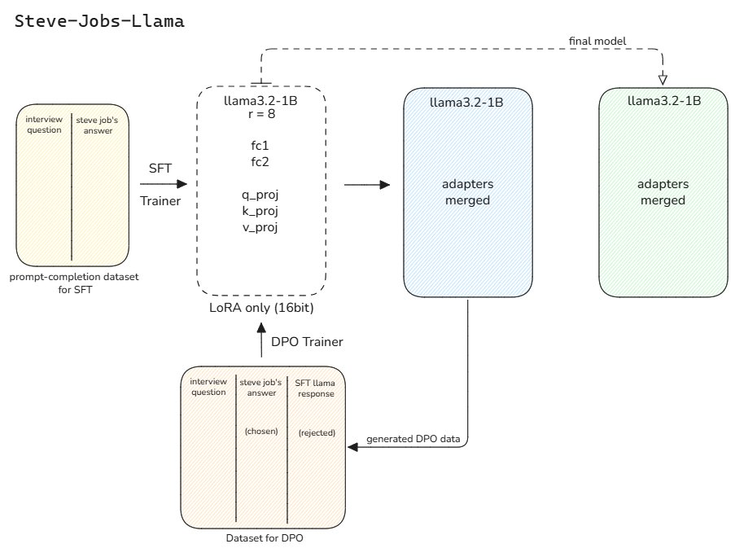
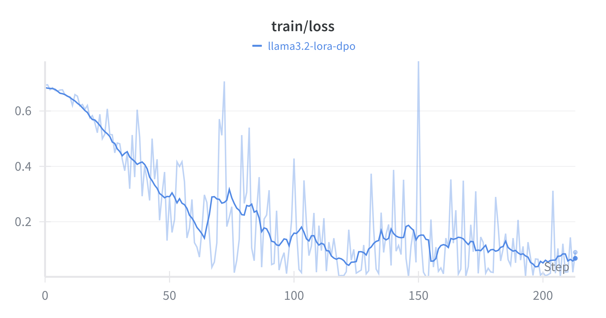

# what-would-jobs-say
Post-training methods on Llama3.2-1B to find out what Steve Jobs would say

- [Steve Jobs Interviews DPO Dataset](https://huggingface.co/datasets/grasgor/steve-jobs-interviews-dpo)
- [Jobs Llama3.2-1B SFT Model](https://huggingface.co/grasgor/jobs-llama3.2-1B-sft)
- [Ollama](https://ollama.com/grasgor10/jobs-llama)



## Setup

1. Install the required dependencies:
   ```bash
   pip install -r requirements.txt
   ```

2. (Optional) Log in to Hugging Face and WandB if you plan to push models or track experiments:
   ```bash
   huggingface-cli login
   wandb login
   ```

## Training

To fine-tune the model using Supervised Fine-Tuning (SFT), use the `train.py` script.

**Basic Usage:**
```bash
python src/train.py
```

**Custom Usage:**
You can customize the model, dataset, and hyperparameters via command-line arguments:

```bash
python src/train.py \
    --model_name "meta-llama/Llama-3.2-1B" \
    --dataset_name "Hypersniper/Steve_Jobs_Interviews" \
    --output_dir "./my_custom_jobs_model" \
    --num_train_epochs 5 \
    --learning_rate 2e-4 \
    --use_wandb
```

**Key Arguments:**
- `--model_name`: The base model to fine-tune (default: `meta-llama/Llama-3.2-1B`).
- `--dataset_name`: The Hugging Face dataset to use (default: `Hypersniper/Steve_Jobs_Interviews`).
- `--output_dir`: Directory to save the trained model (default: `./llama3.2_jobs_sft`).
- `--use_wandb`: Enable Weights & Biases logging.



## Inference

To generate text with the trained model, use the `inference.py` script.

**Usage:**
```bash
python src/inference.py --prompt "What is the future of computing?" --adapter_path "./llama3.2_jobs_sft"
```

**Key Arguments:**
- `--prompt`: The input text to generate a response for.
- `--adapter_path`: Path to the trained LoRA adapters (default: `./llama3.2_jobs_sft`).
- `--base_model`: The base model used for training (default: `meta-llama/Llama-3.2-1B`).
- `--merge`: Merge the adapters into the base model before inference (can be faster but uses more RAM initially).
